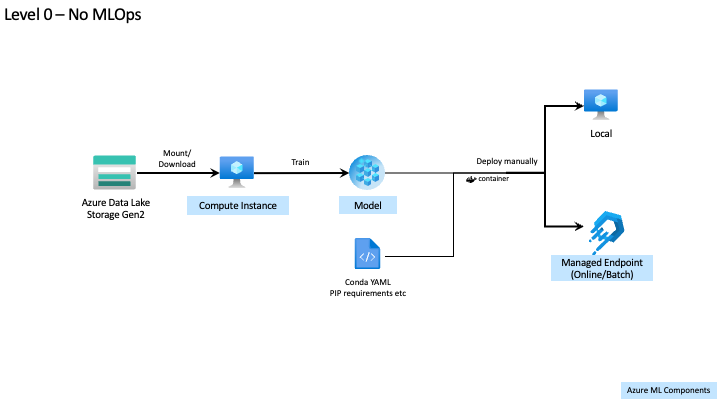
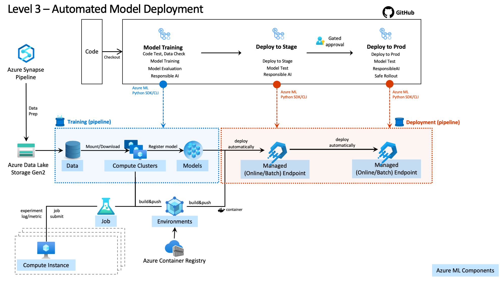

<!-- 
## Goal of this blog
MLOps is a concept and technology of DevOps of machine learning. Many customers are confusing about MLOps because "MLOps" become buzz phrase like AI we saw a few years ago. This blog will introduce "MLOps Maturity Model" created mainly by CSE team which defines what to implement in each level and will be very helpful customers to set concrete goals of their machine learning projects in implementing MLOps technology.

## Agenda
- Introduction
    - Introduction to MLOps and Maturity Model
- Maturity Model with Azure Machine Learning
    - Level 0 : No MLOps
    - Level 1 : DevOps no MLOps
    - Level 2 : Automated Training
    - Level 3 : Automated Model Deployment
    - Level 4 : Full MLOps Automated Retraining
- Code examples using
    - next blog?
-->

# MLOps Maturity Model with Azure Machine Learning (Concept)

 

## Introduction
MLOps (machine learning operations) is based on DevOps principles and practices that increases overall workflow efficiencies and qualities in machine learning lifecycle. By adopting and implementing MLOps, you can make your ML system more agile and more scalable and then increase the qualities and responsibilities.

### MLOps Maturity Model

To clarify the principles and practices of MLOps, Microsoft defines MLOps maturity model. Because different AI Systems have different requirements and difference organizations have different maturity levels, MLOps maturity model will be useful and helpful in the following points.

- set goals of their machine learning projects in implementing MLOps technologies.
- set plans to grow your MLOps capabilities in increments.

This table is a abstract of each level of MLOps maturity model. Be careful, it depends on the requirements of your organization and ML system which level is your goal to go. We will introduce more details in the following sections of this blog.

|Maturity Level| Training Process | Release Process| Integration into app|
|---|---|---|---|
|Level 0 - No MLOps|Untracked, file is provided for handoff|Manual, hand-off|Manual, heavily DS driven|
|Level 1 - DevOps no MLOps|Untracked, file is provided for handoff|Manual, hand-off to SWE|Manual, heavily DS driven, basic integration tests added|
|Level 2 - Automated Training|Tracked, run results and model artifacts are captured in a repeatable way|Manual release,clean handoff process, managed by SWE team|Manual, heavily DS driven, basic integration tests added|
|Level 3 - Automated Model Deployment|Tracked, run results and model artifacts are captured in a repeatable way|Automated, CI/CD pipeline set up, everything is version controlled|Semi-automated, unit and integration tests added, still needs human signoff|
|Level 4 - Full MLOps Automated Retraining|Tracked, run results and model artifacts are captured in a repeatable way, retraining set up based on metrics from app|Automated, CI/CD pipeline set up, everything is version controlled, A/B testing has been added|Semi-automated, unit and integration tests added, may need human signoff|

>caution: As you go to high level maturity, not only technologies but also people and cultures are importance. This blog is focus on technology. Please see [AI Business school](https://www.microsoft.com/en-us/ai/ai-business-school) to learn about AI strategies in your organization, AI-ready culture etc.

 

### MLOps with Azure Machine Learning

Azure Machine Learning is a open source friendly machine learning platform to implement full machine learning lifecycle and MLOps in cooperation with GitHub (or Azure DevOps) and Responsible AI technologies etc.

### Azure Machine Learning Workspace and assets

In the following sections, we will use Azure Machine Learning Workspace and assets to use to implement MLOps. 

Azure Machine Learning Workspace is the top-level resource for Azure Machine Learning. Azure Machine Learning Workspace works with  `Azure Storage Account`, `Azure Container Registry`, `Azure Key Vault`, `Azure Application Insights` and related Azure services depending on your requirements.

Here is a list of Azure Machine Learning assets you should know before reading this blog.

- Data (Datastores & Datasets)
- Job (Experiments and Runs)
- Model
- Environment
- Component
- Pipeline
- Endpoint

For more details, please check out [How Azure Machine Learning works: resources and assets (v2)](https://docs.microsoft.com/en-us/azure/machine-learning/concept-azure-machine-learning-v2?tabs=cli).
 

## Maturity Model with Azure Machine Learning

In this section, we will explain the abstract and the details with Azure Machine Learning technologies in each level of Maturity Model.

---

### Level 0 : No MLOps

This is a level to pre-process data manually from data source and train and deploy model interactively and exploratory.Data scientists work on a individual basis to find best model. It is also PoC phase in the project. 

There will be reproducibility issues of your machine learning models. Assets generated in the platform which is not maintained by the organizations. And no test is configured. So deployed model is unreliable and not responsible.

 

| People | Model Creation | Model Release | Application Integration |
| ------ | -------------- | ------------- | ----------------------- |
| <ul><li>Data scientists: siloed, not in regular communications with the larger team<li>Data engineers (_if exists_): siloed, not in regular communications with the larger team<li>Software engineers: siloed, receive model remotely from the other team members</ul> | <ul><li>Data gathered manually<li>Compute is likely not managed<li>Experiments aren't predictably tracked<li>End result may be a single model file manually handed off with inputs/outputs</ul> | <ul><li>Manual process<li>Scoring script may be manually created well after experiments, not version controlled<li>Release handled by data scientist or data engineer alone</ul> | <ul><li>Heavily reliant on data scientist expertise to implement<li>Manual releases each time</ul> |

#### Azure Machine Learning perspective

If you use Azure Machine Learning, Compute Instance is a good place to start for your machine learning journey. It includes essential Python/R libraries and development tools like JupyterLab, R Studio and VSCode remote development feature.
 

#### Challenges

- Reproducibility
    - It is very difficult to reproduce training model job because data scientists use their own customized machine learning tools and codes and Python/R packages that are used by each data scientists are not shared within the organization.
- Quality & Security
    - No test is configured. Or test policies are not design across the organization.
    - There are security concerns in machine learning tools that are not maintained by IT.
- Scalability
    - Often compute resources don't have enough power to run job at scale.
    - High-performance compute resources are not shared within organization, that leads to cost to increase.
- Other
    - Data source is not maintained for machine learning. It requires manual steps to get training data.

#### What's next?

- Standardize the machine learning platform across the organizations and create shared high-performance compute resources.
- Setup code repository and share code used by data scientists.
- Configure and automate code test against train and score scripts.
- Setup data pipeline to be able to get data easily.

Next, we will introduce _Level 1 : DevOps no MLOps_

---

### Level 1 : DevOps no MLOps

This is a level that data scientists work on a standardized machine learning platform and data pipeline is maintained by data engineers.

Reproduce the model training is still difficult because machine learning assets like data, python packages are not shared and job denpedencies are maintained by each data scientists (not shared).

 

| People | Model Creation | Model Release | Application Integration |
| ------ | -------------- | ------------- | ----------------------- |
| <ul><li>Data scientists: siloed, not in regular communications with the larger team<li>Data engineers (if exists): siloed, not in regular communication with the larger team<li>Software engineers: siloed, receive model remotely from the other team members</ul> | <ul><li>Data pipeline gathers data automatically<li>Compute is or isn't managed<li>Experiments aren't predictably tracked<li>End result may be a single model file manually handed off with inputs/outputs</ul> | <ul><li>Manual process<li>Scoring script may be manually created well after experiments, likely version controlled<li>Is handed off to software engineers</ul> | <ul><li>Basic integration tests exist for the model<li>Heavily reliant on data scientist expertise to implement model<li>Releases automated<li>Application code has unit tests</ul> |

#### Azure Machine Learning perspective

Azure Machine Learning is a shared and collaborative machine learning platform. By using Data feature, you can access to data source easily. Once you trained model, you can register it to Model feature and deploy using Managed Endpoints that is new version of endpoint feature.

Azure Machine Learning can integrate with GitHub. So you can share your train and inference code on GitHub and you can test codes automatically using GitHub Actions.
 

#### Challenges

- Reproducibility
    - Assets are not shared in machine learning lifecycle.
    - Job dependencies are also not shared.

#### What's next?

- Ensure reproducibility of the experiments.
    - Automate and reproduce model training.
    - Save assets associated with the experiments.
    - Define job dependencies in the pipeline.
- Operate model.
    - Maintain model and associate it with the experiments and endpoints.

---

### Level 2 : Automated Training

 

| People | Model Creation | Model Release | Application Integration |
| ------ | -------------- | ------------- | ----------------------- |
| <ul><li>Data scientists: Working directly with data engineers to convert experimentation code into repeatable scripts/jobs<li>Data engineers: Working with data scientists<li>Software engineers: siloed, receive model remotely from the other team members</ul> | <ul><li>Data pipeline gathers data automatically<li>Compute managed<li>Experiment results tracked<li>Both training code and resulting models are version controlled</ul> | <ul><li>Manual release<li>Scoring script is version controlled with tests<li>Release managed by Software engineering team</ul> | <ul><li>Basic integration tests exist for the model<li>Heavily reliant on data scientist expertise to implement model<li>Application code has unit tests</ul> |

#### Azure Machine Learning perspective

Azure ML `Job`, `Data` and `Environment` are very useful to automate your training job. `Job` manages your training job and logs parameters and metrics. `Data` is an abstract data source for training job. And `Environment` defines Python packages, environment variables, and Docker settings.

Azure Machine Learning CLI v2 is a new version of Azure Machine Learning. You can define your job using YAML files and execute your job via command lines (Azure CLI). Python SDK is also available if you want to define using Python code. And if you job has complex dependencies, you can use Azure ML `Pipeline` to design your job workflows.

And you can use GitHub Actions to trigger model training job easily via Azure ML CLI v2. Typical cases are as follows:

- Trigger model training job every time code in GitHub was changes by pull request.
- Trigger model training job to train model on a schedule to adopt to new data.

 

#### Challenges

- Deployment
    - Deploy models into multiple inference endpoints quickly.
- Model quality
    - Test the trained model behavior and performance.
    - Ensure model has interpretability/explainability and/or fairness.

#### What's next?

- Deploy pipelines.
    - Build container that receive data and return prediction results nad build pipeline to deploy container into container runtime like Kubernetes.
    - Build pipeline that receive batch data from data sources and return prediction results into data sources.
- Implement model quality.
    - Automated test model using test data.
    - Interpret model or explain modelEnsure model with explanability techniques.

---

### Level 3 : Automated Model Deployment

 

| People | Model Creation | Model Release | Application Integration |
| ------ | -------------- | ------------- | ----------------------- |
| <ul><li>Data scientists: Working directly with data engineers to convert experimentation code into repeatable scripts/jobs<li>Data engineers: Working with data scientists and software engineers to manage inputs/outputs<li>Software engineers: Working with data engineers to automate model integration into application code</ul> | <ul><li>Data pipeline gathers data automatically<li>Compute managed<li>Experiment results tracked<li>Both training code and resulting models are version controlled</ul> | <ul><li>Automatic release<li>Scoring script is version controlled with tests<li>Release managed by continuous delivery (CI/CD) pipeline</ul> | <ul><li>Unit and integration tests for each model release<li>Less reliant on data scientist expertise to implement model<li>Application code has unit/integration tests</ul> |

#### Azure Machine Learning perspective
 

Managed Endpoint is very useful to deploy model into inference environments. You can deploy it using Azure ML CLI v2 and automate by using GitHu Actions.

If you want to put gate between Stage and Production, you can use GitHub environments.

#### Challenges

- Model degradation
    - Model performance degrades over time.
- Model Retraining
    - Inference environments are not monitored enough. It is difficult to when to retrain model.

- Deployment
    - Update models with minimal user impact.
- Monitoring
    - Detect data drift and performance degradation.
- Automation
    - Retrain model automatically based on monitoring metrics and logs.

#### What's next?

- Monitoring inference environments.
    - Detect data drift by regularly scan data.
    - Monitor metrics and logs that are associated with your model performance.
- Automation
    - Trigger training pipeline for retraining model based on metrics and logs (above).
    - Rollout new model safely into production endpoint using blue/green deployment.

---

### Level 4 : Full MLOps Automated Retraining

 

| People | Model Creation | Model Release | Application Integration |
| ------ | -------------- | ------------- | ----------------------- |
| <ul><li>Data scientists: Working directly with data engineers to convert experimentation code into repeatable scripts/jobs. Working with software engineers to identify markers for data engineers<li>Data engineers: Working with data scientists and software engineers to manage inputs/outputs<li>Software engineers: Working with data engineers to automate model integration into application code. Implementing post-deployment metrics gathering</ul> | <ul><li>Data pipeline gathers data automatically<li>Retraining triggered automatically based on production metrics<li>Compute managed<li>Experiment results tracked<li>Both training code and resulting models are version controlled</ul> | <ul><li>Automatic Release<li>Scoring Script is version controlled with tests<li>Release managed by continuous integration and CI/CD pipeline</ul> | <ul><li>Unit and Integration tests for each model release<li>Less reliant on data scientist expertise to implement model<li>Application code has unit/integration tests</ul> |

 

---

## Summary

## About the author

Keita Onabuta