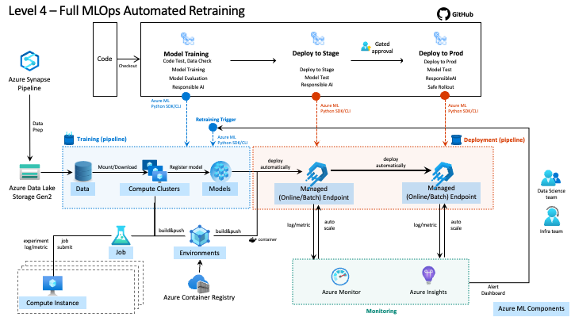

<!-- 
## Goal of this blog
MLops is just a concept of DevOps of machine learning. Many customers are confusing about MLOps because "MLOps" become buzz phrase like AI we saw a few years ago. This blog introduce "MLOps Maturity Model" created mainly by CSE team which defines what to implement in each level and will be very helpful customers to set a concrete goal of their machine learning projects in implementing MLOps technology.

## Agenda
- Introduction
    - Introduction to MLOps and Maturity Model
- Maturity Model with Azure Machine Learning
    - Level 0 : No MLOps
    - Level 1 : DevOps no MLOps
    - Level 2 : Automated Training
    - Level 3 : Automated Model Deployment
    - Level 4 : Full MLOps Automated Retraining
- Code examples using
    - next blog?
-->

# MLOps Maturity Model with Azure Machine Learning (Concept)

 

## Introduction
MLOps (machine learning operations) is based on DevOps principles and practices that increases workflow efficiencies in machine learning lifecycle. By implementing MLOps, you can make your ML project more agile and more scalable and increase the quality and responsibility.

### MLOps Maturity Model

To clarify the principle and practice of MLOps, Microsoft defines MLOps maturity model. Because different AI Systems have different requirements and difference organizations and team have different maturity levels, MLOps maturity model will be helpful in the following points.

- set a goal of their machine learning projects in implementing MLOps technologies.
- set a plan to grow your MLOps capability in increments.

This table is a abstract of each level of MLOps maturity model. We will introduce more details in the following sections of this blog.

|Maturity Level| Training Process | Release Process| Integration into app|
|---|---|---|---|
|Level 0 - No MLOps|Untracked, file is provided for handoff|Manual, hand-off|Manual, heavily DS driven|
|Level 1 - DevOps no MLOps|Untracked, file is provided for handoff|Manual, hand-off to SWE|Manual, heavily DS driven, basic integration tests added|
|Level 2 - Automated Training|Tracked, run results and model artifacts are captured in a repeatable way|Manual release,clean handoff process, managed by SWE team|Manual, heavily DS driven, basic integration tests added|
|Level 3 - Automated Model Deployment|Tracked, run results and model artifacts are captured in a repeatable way|Automated, CI/CD pipeline set up, everything is version controlled|Semi-automated, unit and integration tests added, still needs human signoff|
|Level 4 - Full MLOps Automated Retraining|Tracked, run results and model artifacts are captured in a repeatable way, retraining set up based on metrics from app|Automated, CI/CD pipeline set up, everything is version controlled, A/B testing has been added|Semi-automated, unit and integration tests added, may need human signoff|

### MLOps with Azure Machine Learning

In Azure, you can use Azure Machine Learning to implement fully machine learning lifecycle and MLOps in cooperation with GitHub (or Azure DevOps) and Responsible AI technologies etc.

### Azure Machine Learning Workspace and assets

In the following sections, we will use Azure Machine Learning Workspace and assets to use to implement MLOps. 

Azure Machine Learning Workspace is the top-level resource for Azure Machine Learning. Azure Machine Learning Workspace works with  `Azure Storage Account`, `Azure Container Registry`, `Azure Key Vault`, `Azure Application Insights` and related Azure services depending on your requirements.

Here is a list of Azure Machine Learning assets you should know before reading this blog.

- Datastores & Datasets
- Experiments and Runs
- Models
- Environments
- Endpoints
- Pipelines

 

## Maturity Model with Azure Machine Learning

In this section, we will explain the details of each level of Maturity Model.

---

### Level 0 : No MLOps

This is the level to preprocess data, train model and deploy model interactively and exploratory. Data scientists work on a individual basis. There will be reproducibility issues of your machine learning models. Assets generated in the platform which is not maintained by the organization and team are unreliable and not responsible.

 

| People | Model Creation | Model Release | Application Integration |
| ------ | -------------- | ------------- | ----------------------- |
| <ul><li>Data scientists: siloed, not in regular communications with the larger team<li>Data engineers (_if exists_): siloed, not in regular communications with the larger team<li>Software engineers: siloed, receive model remotely from the other team members</ul> | <ul><li>Data gathered manually<li>Compute is likely not managed<li>Experiments aren't predictably tracked<li>End result may be a single model file manually handed off with inputs/outputs</ul> | <ul><li>Manual process<li>Scoring script may be manually created well after experiments, not version controlled<li>Release handled by data scientist or data engineer alone</ul> | <ul><li>Heavily reliant on data scientist expertise to implement<li>Manual releases each time</ul> |

 

#### Challenges

- Platform
    - Standardize the machine learning platform.
    - Get machines/clusters that have enough power to run machine learning job.
    - Set up code repository.
- Code Quality
    - Write code in a way that can be tested and unit test is ready. 

#### What's next?

- Standardize the machine learning platform across organizations and teams.
- Setup code repository.
- Automate code test.
- Setup data platform.

---

### Level 1 : DevOps no MLOps

 

| People | Model Creation | Model Release | Application Integration |
| ------ | -------------- | ------------- | ----------------------- |
| <ul><li>Data scientists: siloed, not in regular communications with the larger team<li>Data engineers (if exists): siloed, not in regular communication with the larger team<li>Software engineers: siloed, receive model remotely from the other team members</ul> | <ul><li>Data pipeline gathers data automatically<li>Compute is or isn't managed<li>Experiments aren't predictably tracked<li>End result may be a single model file manually handed off with inputs/outputs</ul> | <ul><li>Manual process<li>Scoring script may be manually created well after experiments, likely version controlled<li>Is handed off to software engineers</ul> | <ul><li>Basic integration tests exist for the model<li>Heavily reliant on data scientist expertise to implement model<li>Releases automated<li>Application code has unit tests</ul> |

 

#### Challenges

- Reproducibility
    - Save assets in machine learning lifecycle
    - Reproduce the experiments
    - Setup pipeline to run model training and deployment.
    - Save model and ready to compare new model with old model.

#### What's next?

- Ensure reproducibility of the experiments.
    - Model training and deployment can be reproduced easily. Assets are saved associated with the experiments.
- Operate model.
    - Models are maintained and can be associated with the experiments and endpoints.

---

### Level 2 : Automated Training

 

| People | Model Creation | Model Release | Application Integration |
| ------ | -------------- | ------------- | ----------------------- |
| <ul><li>Data scientists: Working directly with data engineers to convert experimentation code into repeatable scripts/jobs<li>Data engineers: Working with data scientists<li>Software engineers: siloed, receive model remotely from the other team members</ul> | <ul><li>Data pipeline gathers data automatically<li>Compute managed<li>Experiment results tracked<li>Both training code and resulting models are version controlled</ul> | <ul><li>Manual release<li>Scoring script is version controlled with tests<li>Release managed by Software engineering team</ul> | <ul><li>Basic integration tests exist for the model<li>Heavily reliant on data scientist expertise to implement model<li>Application code has unit tests</ul> |

 

#### Challenges

- Deployment
    - Deploy models into multiple inference endpoints quickly.
- Model quality
    - Test the trained model behavior and performance.
    - Ensure model has interpretability/explainability and/or fairness.

#### What's next?

- Deploy pipelines.
    - Build container that receive data and return prediction results nad build pipeline to deploy container into container runtime like Kubernetes.
    - Build pipeline that receive batch data from data sources and return prediction results into data sources.
- Implement model quality.
    - Automated test model using test data.
    - Interpret model or explain modelEnsure model with explanability techniques.

---

### Level 3 : Automated Model Deployment

 

| People | Model Creation | Model Release | Application Integration |
| ------ | -------------- | ------------- | ----------------------- |
| <ul><li>Data scientists: Working directly with data engineers to convert experimentation code into repeatable scripts/jobs<li>Data engineers: Working with data scientists and software engineers to manage inputs/outputs<li>Software engineers: Working with data engineers to automate model integration into application code</ul> | <ul><li>Data pipeline gathers data automatically<li>Compute managed<li>Experiment results tracked<li>Both training code and resulting models are version controlled</ul> | <ul><li>Automatic release<li>Scoring script is version controlled with tests<li>Release managed by continuous delivery (CI/CD) pipeline</ul> | <ul><li>Unit and integration tests for each model release<li>Less reliant on data scientist expertise to implement model<li>Application code has unit/integration tests</ul> |

 

#### Challenges

- Deployment
    - Update models with minimal user impact.
- Monitoring
    - Detect data drift and performance degradation.
- Automation
    - Retrain model automatically based on monitoring metrics and logs.

#### What's next?

- Monitoring system to detect data drift and performance degradation.
    - List of metrics and logs to monitor.
    - Build systems to gather logs and calculated metrics quickly.
- E2E Automation.
    - Implement pipelines for model training and deployment pipelines that can be executed without interruption.
    - Build systems to monitor blue/green deployment and retrained model.
    - Implement triggers to run retraining and redeployment based on monitoring metrics and logs.

---

### Level 4 : Full MLOps Automated Retraining

 

| People | Model Creation | Model Release | Application Integration |
| ------ | -------------- | ------------- | ----------------------- |
| <ul><li>Data scientists: Working directly with data engineers to convert experimentation code into repeatable scripts/jobs. Working with software engineers to identify markers for data engineers<li>Data engineers: Working with data scientists and software engineers to manage inputs/outputs<li>Software engineers: Working with data engineers to automate model integration into application code. Implementing post-deployment metrics gathering</ul> | <ul><li>Data pipeline gathers data automatically<li>Retraining triggered automatically based on production metrics<li>Compute managed<li>Experiment results tracked<li>Both training code and resulting models are version controlled</ul> | <ul><li>Automatic Release<li>Scoring Script is version controlled with tests<li>Release managed by continuous integration and CI/CD pipeline</ul> | <ul><li>Unit and Integration tests for each model release<li>Less reliant on data scientist expertise to implement model<li>Application code has unit/integration tests</ul> |

 

---

## Conclusion

## About the author

Keita Onabuta